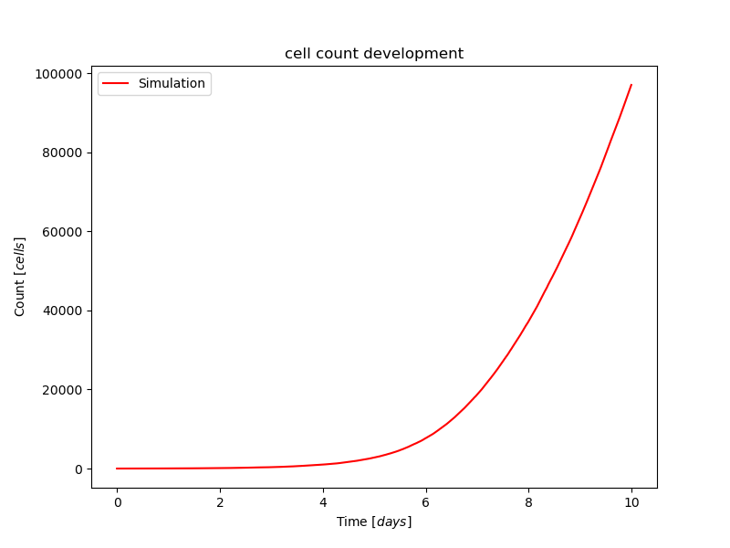
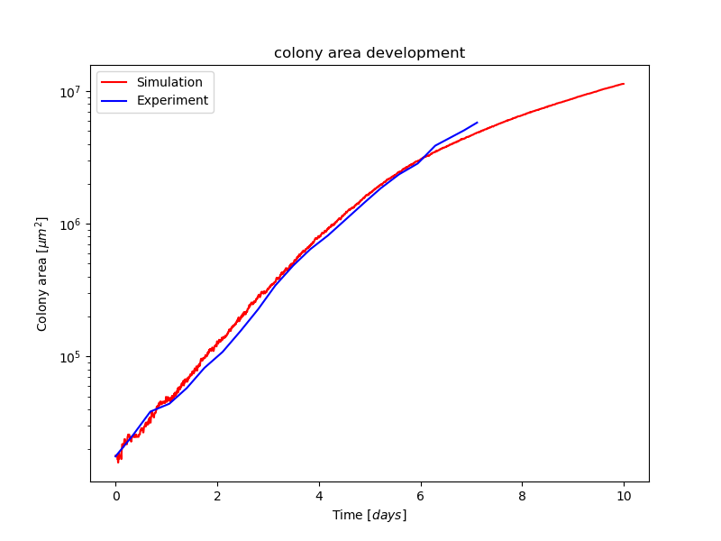
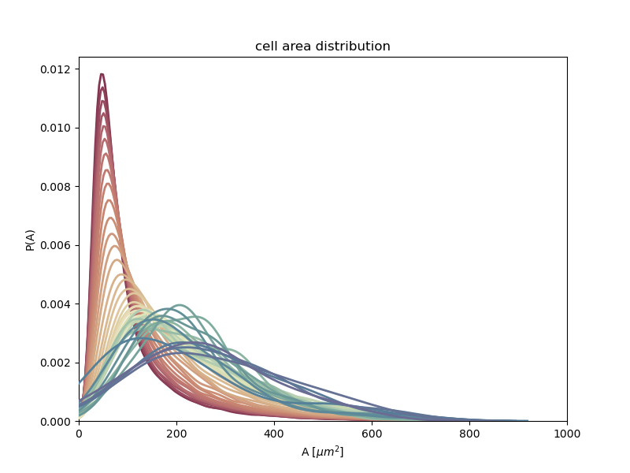
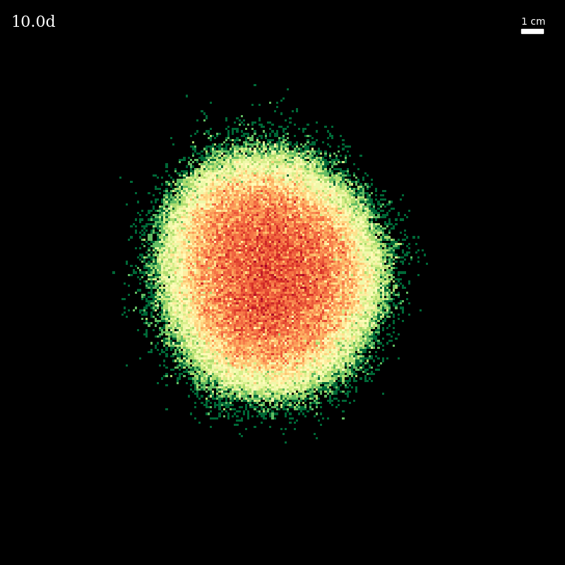
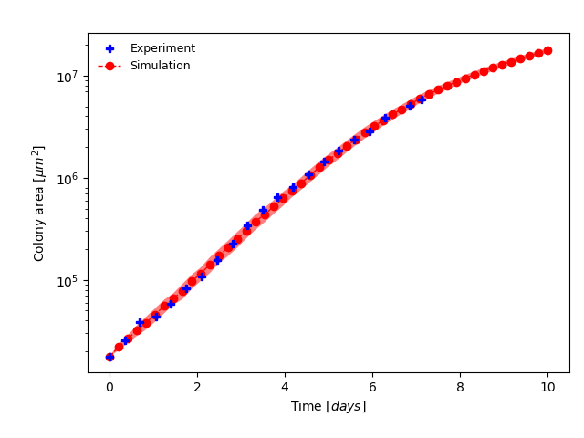
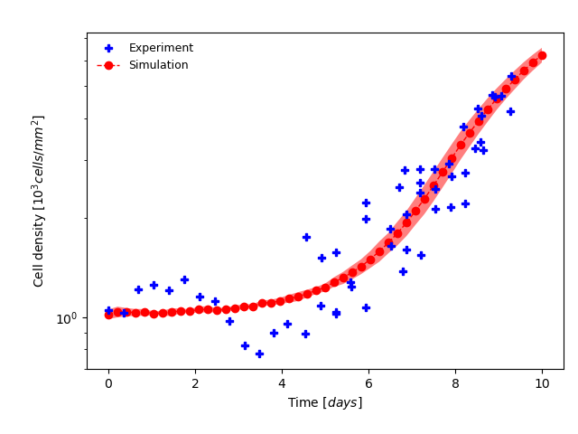
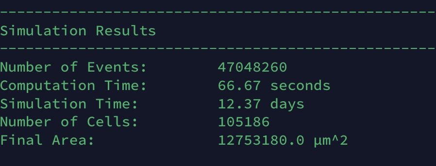

# Python Cellular Automata

Python implementation of the cellular automata model corresponding to [Lange, Schmied et. al](https://arxiv.org/abs/2403.07612).

## Overview

* test/ - contains various scripts/notebooks for testing purposes
* cellularautomaton.py - _the_ Automata. Used to run experiments
* parameters.py - contains parameters for the automata
* multiverse.[sh|ps1] - runs multiverse
* plot.py - generates plots for multiverse (also works if -n = 1)
* requirements.txt - list of dependencies. Install with `pip install -r requirements.txt` or `conda install -c conda-forge --file requirements.txt`

## Options

### Automata (cellularautomaton.py)

```
usage: cellularautomaton.py [-h] [--box] [--colonial] [--dt DT] [--gridsize GRIDSIZE] [--movementspeed MOVEMENTSPEED] [--seed SEED] [--symmetric] [--experimental] [--tmax TMAX] [--multiverse MULTIVERSE]
                            [--real REAL] [--expdata EXPDATA] [--output OUTPUT] [--exportcsv] [--exporthdf] [--plot] [--plothist]

optional arguments:
  -h, --help            show this help message and exit
  --box                 Run box experiment
  --colonial            Run colonial experiment
  --dt DT               Time step width (in min, default: 6)
  --gridsize GRIDSIZE   Grid edge size (default: 256 for Colonial and 12 for Box experiment)
  --movementspeed MOVEMENTSPEED, -v MOVEMENTSPEED
                        Specify movement speed of cells (in µm/h)
  --seed SEED, -s SEED  Simulation seed
  --symmetric           Toggle symmetric/asymmetric proliferation (asymmetric by default)
  --experimental        Enable experimental features
  --tmax TMAX           Maximum time (in days, default: 8 for Colonial and 15 for Box experiment)
  --multiverse MULTIVERSE
                        Specify multiverse id of current simulation
  --real REAL           Specify realisation index of current simulation
  --expdata EXPDATA     Path to experimental data
  --output OUTPUT, -o OUTPUT
                        Specify output directory
  --exportcsv           Export colony development history to csv
  --exporthdf           Export colony development history to hdf5
  --plot                Create and save plots during experiment (final stage only)
  --plothist            Save plots during colony development
```

### Multiverse (multiverse.[sh|ps1])

```
usage: multiverse.[ps1|sh] [-n] <Number of Realisations> [-box|--box] [-plot|--plot]

options:
  -n NUMBER             Specify number of Realisations (.ps1 only, in .sh use it without -n)
  --box                 Specify that experiment is of type box (different plot output)
  --plot                Create and save plots after run finished 
```

## Examples

It's easiest to run all modules using the module syntax from the root directory of the project (CellularAutomataPython).

### Single Run

Run colonial experiment, 12 days, calculate every 6 min:

`python -m src.cellularautomaton --colonial --dt 6 --tmax 10 --plot --exportcsv`

### Multiverse Run

* `.\multiverse.ps1 -n 20 -plot` on Windows
* `./multiverse.sh 20 --plot` on *nix

### Plotting

Note: `--plot` is optional for Multiverse. Alternatively, you can always generate plots manually afterward by calling the plot script:

`python -m src.utils.plot --path /path/to/multiversum_xxxxx --expdata /path/to/cellularautomata_experimentaldata/Puliafito_2012_01_17 --output pdf [--box]`.

Options:
* `--output`: Specify output format. Default: `png`. Other options: `pdf`, `svg`.

#### Generated Plots

Development of cell count, colony area, cell area distribution (single run):





Cell culture (by density) and growth history collage (single run):




Development of colony area, cell density (multiverse):




### Performance


